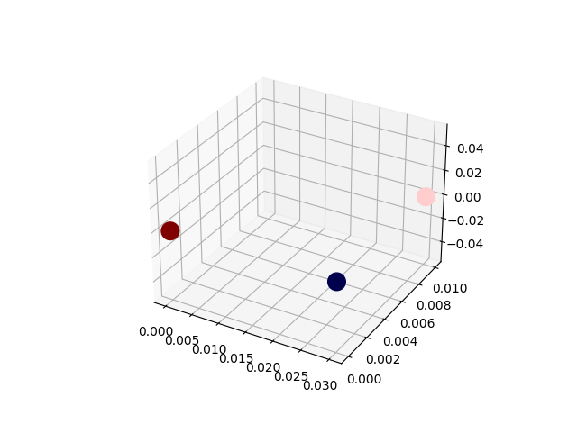

# PhysicsTools
##### by Maximo Xavier DeLeon

Putting concepts learned in class to use

Current funtionality
* Calculate the electric field strength between two point charges
* Calculate the electrostatic force between two point charges
* Summate the corces acting on a user defined point charge
* Add point charges to any points to a 3d space
* Remove point charges
* Create point charge objects

